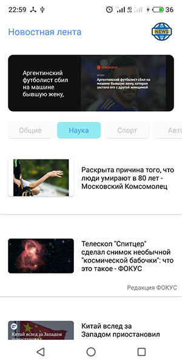

# О приложении
Приложение реализовано в рамках тестового задания от компании "22Byte".

Приложение "Новости" позволяет получать актуальные новости по различным темам, используя сервис "https://newsapi.org"

## Скриншоты
 

## Используемый стек
- MVVM
- Clean Architecture
- Retrofit
- Glide
- Kotlin Coroutines

### Возможности приложения
- загружает из сети и отображает актуальные новости в RecyclerView и ViewPager2
- пользователь может переключаться между категориями новостей (реализованы 4 категории: общие, наука, спорт и авто)
- планка с категориями при скролле прилипает к верхнему бару

### Формулировка задания
Сделать новостную ленту(recycleView) с приятным дизайном.
Контент брать из api, к примеру https://newsapi.org/.
Добавить рандомную иконку. Решение лучше отправлять zip-файлом либо репозиторие на гитхаб. Засечь время выполнения задания.

### Разработчик
Альберт Сафин
